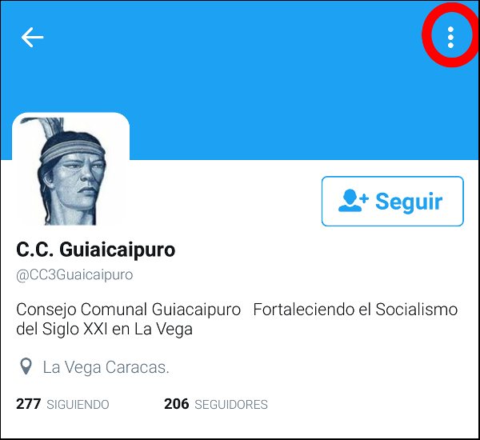
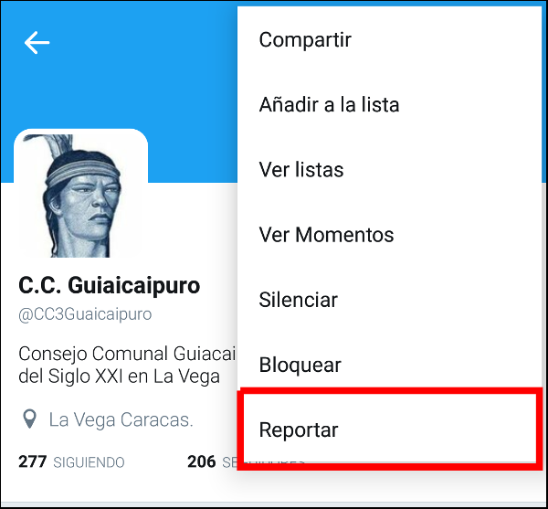

# BOTalos

[Lista de Bots](#lista-de-bots-a-reportar) | [¿Cómo reportar desde el teléfono?](#cómo-reportar-bots-en-el-teléfono) | [¿Cómo reportar desde la computadora?](#cómo-reportar-bots-en-la-computadora) 
:------------: | :-------------: | :-------------:
 |  | 

 
 

## Lista de bots a reportar
Abajo encontrarás un listado de usuarios con enlaces a asus cuentas, 

[@somosrevolucion](http://twitter.com/user2) | [@Pedrod1azM](http://twitter.com/user2) | Second Header | Second Header
:------------ | :------------- | :------------- | :-------------
[user2](http://twitter.com/user2) | [user2](http://twitter.com/user2) | Content from cell  | Content from cell 
Content in the first column | Content in the second column | Content from cell  | Content from cell 
  
  -----------------------------------------
  

## ¿Cómo reportar bots en el teléfono?

### 1. En el perfil de la cuenta presionar los 3 puntos

### 2. En el menú que aparece presionar "Reportar"

### 3. En la ventana que aparece presionar "Está publicando spam", presionar "Siguiente" y luego el botón "Listo"

## ¿Cómo reportar bots en la computadora?

### 1. En el perfil de la cuenta presionar los 3 puntos

### 2. En el menú que aparece presionar "Reportar a @usuario"

### 3. En la ventana que aparece presionar "Está publicando spam", presionar "Siguiente" y luego el botón "Listo"

